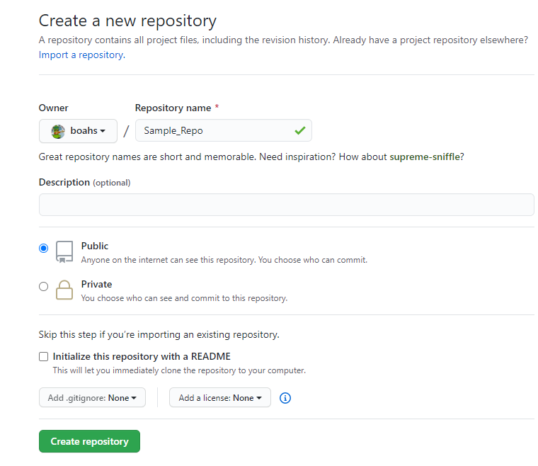

## The almighty terminal

The terminal at first glance may seem intimidating since you aren't presented with a fancy GUI(Graphical user interface) but once you start to get the hang of things you'll be <b>C</b>hanging <b>D</b>irectories faster than you could even with a gui! 

Being able to properly use the terminal is a necessity for <i>every</i> developer! Especially when working with Node and react! This article is going to be using [Git BASH](https://git-scm.com/download/win) for windows - which functions exactly like LINUX, and UNIX environments! 

## Commands 

#### LS 
LS stands for 'List information' and will be one of the most freqently commands you'll use: 

```bash
Boahs@DESKTOP /c/Sample_Directory/BoahsInfo_Git_Tutorial
$ ls
example_directory/  example_file.txt
```

What you're seeing above is the LS command being executed to print out the current contents of the directory we're in. if we use the <b>touch</b> command we can create a file inside the directory, and it'll show up with the ls command: 

```bash
Boahs@DESKTOP /c/Sample_Directory/BoahsInfo_Git_Tutorial
$ touch make_text_file.txt

Boahs@DESKTOP /c/Sample_Directory/BoahsInfo_Git_Tutorial
$ ls
example_directory/  example_file.txt  make_text_file.txt
```

#### CD 

CD stands for 'change directory' and will be used to navigate through the directories on the machine you're using. We can change the directory using an absolute path like this: 

```bash
Boahs@DESKTOP /c
$ cd Sample_Directory/

Boahs@DESKTOP /c/Sample_Directory
$ cd BoahsInfo_Git_Tutorial/example_directory/

Boahs@DESKTOP /c/Sample_Directory/BoahsInfo_Git_Tutorial/example_directory
$ ls
more_example_Files.txt
```

The inputs we sent our terminal above ended up changing out directory from the ```C:\``` drive to the ```Sample_Directory/``` directory then we went inside ```BoahsInfo_Git_Tutorial/example_directory/``` using an absolute path to navigate our way there. 

We can also go back to the previous directory with the ```cd ..``` command:

```bash
Boahs@DESKTOP /c/Sample_Directory/BoahsInfo_Git_Tutorial/example_directory
$ cd ..

Boahs@DESKTOP /c/Sample_Directory/BoahsInfo_Git_Tutorial
$ cd ..

Boahs@DESKTOP/c/Sample_Directory
```

You can see when we input ```cd ..``` it brought up back one directory at a time until we were inside ```/Sample_Directory``` This is called the <b>parent directory</b>.

We can also change our directory to the root directory as well with ``` cd / ```, and to another user's home directory with the ``` cd ~(username)``` command. An example would be ``` cd ~boahs```

#### Nano

Nano is another really popular command you'll find yourself using often. It's included in many linux distributions by default, but some users may need to install it through which done on Debian/Ubuntu with ```apt install nano``` and for CentOS/Fedora ```yum install nano```

Let's try using nano to open a document inside our folders.

```bash
Boahs@DESKTOP /c/Sample_Directory/BoahsInfo_Git_Tutorial
$ ls
example_directory/  example_file.txt  make_text_file.txt

Boahs@DESKTOP /c/Sample_Directory/BoahsInfo_Git_Tutorial
$ nano make_text_file.txt
```

Now you're inside make_text_file.txt where you can start making changes. To exit you'll simple hit ```CTRL + X``` but wait! We forgot to save with the ```CTRL + S``` command. Okay, saved? Now we can exit :-). Don't worry we would've been prompted a warning we hadn't saved! 

When we're editing files that we use to configure applications or important system files, we'll start nano with the ```-w``` flag. This will prevent nano from wrapping the lines that are too long to fit on your screen.

#### Git Clone

Git Clone will be used to make a clone(copy) of a repo hosted on github to a local directory on the machine you're using. When ran like this ```git clone https://github.com/boahs/dont_clone_this``` the repo will now be inside the directory you're currently inside:

```bash
Boahs@DESKTOP /c/Sample_Directory
$ git clone https://github.com/boahs/EasyIMDb.git
Cloning into 'EasyIMDb'...
remote: Enumerating objects: 49, done.
remote: Counting objects: 100% (49/49), done.
remote: Compressing objects: 100% (38/38), done.
remote: Total 49 (delta 22), reused 31 (delta 10), pack-reused 0
Unpacking objects: 100% (49/49), 808.68 KiB | 3.53 MiB/s, done.
```
Above we just cloned one of my [repos](https://github.com/boahs/EasyIMDb) to our machine. Let's access that repo now!

```bash
Boahs@DESKTOP /c/Sample_Directory
$ ls
BoahsInfo_Git_Tutorial/  EasyIMDb/

Boahs@DESKTOP /c/Sample_Directory
$ cd EasyIMDb/

Boahs@DESKTOP /c/Sample_Directory/EasyIMDb (master)
$ ls
background.js  icon.png  manifest.json  popup.js
example.gif    LICENSE   popup.html     README.md
```
Now that the repo has been successfully cloned we can see all the contents it that populated it. 

When we're working with a repo that's enormous or continually maintained we can <b>shallow clone</b> the repo:

```bash
Boahs@DESKTOP /c/Sample_Directory/BoahsInfo_Git_Tutorial
$ git clone --depth 1 https://github.com/boahs/CodeWarSolutions.git
Cloning into 'CodeWarSolutions'...
remote: Enumerating objects: 130, done.
remote: Counting objects: 100% (130/130), done.
remote: Compressing objects: 100% (119/119), done.
remote: Total 130 (delta 0), reused 122 (delta 0), pack-reused 0
Receiving objects: 100% (130/130), 19.61 KiB | 912.00 KiB/s, done.

```
Whats happening is only the most recent history of commits are being cloned because we specified the ```depth 1``` <b>option</b>. 

We can use the ```-branch``` arguement to specify a branch to clone instead of the master branch. 

```bash
 git clone -branch staging_branch https://github.com/boahs/CodeWarSolutions.git 
 ``` 

 The example above would only clone the staging_branch branch from the repo. This can be useful in many scenarios but one benefit I'll name is that it would save you a lot of time from downloading the ```HEAD``` ref of the repo.

 So now we'll learn how to actually initialize a repo of our own from scratch. So we'll go inside our directory ```/c/Sample_Directory``` and execute the following: 

```bash
Boahs@DESKTOP /c/Sample_Directory
$ git init
Initialized empty Git repository in C:/Sample_Directory/
```

we've just successfully added our first local repo! Now we'll type ```git add``` to add a test file. This is used to add new code to your repo:

```bash
Boahs@DESKTOP /c/Sample_Directory (master)
$ git add test.txt
warning: LF will be replaced by CRLF in test.txt.
The file will have its original line endings in your working directory
```

Above we can see we added test.txt to our repo successfully. Lets commit it now with ```git commit```:

```bash
Boahs@DESKTOP /c/Sample_Directory (master)
$ git commit -m "Our first commit! We can add a message here to explain what changes we made to the repo, or added."
[master (root-commit) b2d2d66] Our first commit! We can add a message here to explain what changes we made to the repo, or added.
 1 file changed, 1 insertion(+)
 create mode 100644 test.txt
```
<b>note: in this example we're still in the master branch</b>

Now that we've added a commit to our local repo we can give it a home on github. 

* First thing we'll do is go to [github](https://github.com/)
* Secondly we'll log into our account
* Thirdly we'll click + icon and hit '[new repository](https://github.com/new)' 


We can see ```Add .gitignore:``` and ```Add a license:``` we'll ignore those though for now.

* Lastly we'll hit "Create repository"


Once we've done this we'll see two sets of instructions. We're going to choose the third set "push an existing repo from the command line" 

```bash
git remote add origin https://github.com/boahs/Sample_Repo.git
git push -u origin master
```

Once we execute ```git push -u orgin master``` we're pushing anything new we've added with the ```git add``` command. Remember that when adding something new such as a .txt file we need to also add a commit with ```git commit -m "Comment here``` and to actually push it up to the live repo we push it! 


#### Pull requests

Using ```git pull``` will both ```git fetch``` and ```git merge``` for us. Before using the ```pull``` command we should be positive that our local work is commited <b>before</b> we execute the command. If we don't we may run into a <i>dreaded</i> [merge conflict](https://help.github.com/en/github/collaborating-with-issues-and-pull-requests/resolving-a-merge-conflict-using-the-command-line).

We'll use git pull to our master branch (which you should never do, <b>always</b> make your own branch!):

```bash
Boahs@DESKTOP /c/Sample_Directory (master)
$ git pull https://github.com/boahs/Sample_Repo.git master
From https://github.com/boahs/Sample_Repo
 * branch            master     -> FETCH_HEAD
Already up to date.
```

Above we can see we've pulled the branch, and merged our changes with the master branch. We can open a pull request as well by navigating through our repo to "Pull requests" and hitting "New pull request". We can now delete our branch we've merged by clicking 'closed' - We'll see our pull here, simply check it and hit 'delete branch'. Well done - We've successfully merged, and closed! The owner of the repository can now view all the commits, pull requests...etc and click 'Confirm merge' if they agree with your changes. 

# Conclusion

We've learned command line commands such as ```ls``` and ```cd``` to navigate our way around the terminal, and ```nano``` to create new files. We've also learned how to create a repo and clone a repo to edit locally on our machine, and also how to clone specific branches of that repo with the ```git clone``` command, and ```git clone -branch <branch name>``` command. When we ran ```git init``` inside our ```C:/Sample_directory/``` directory while also realizing we can ```git add``` to add our new files/code to the repo. Well done today!


